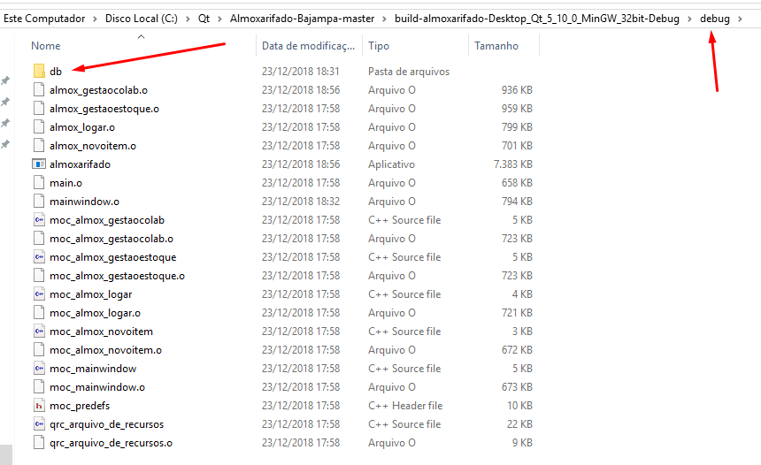
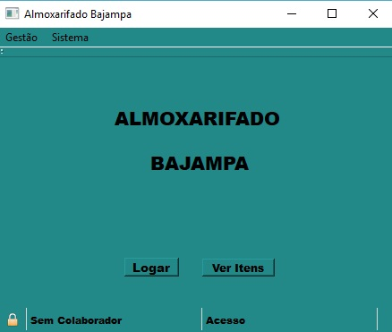
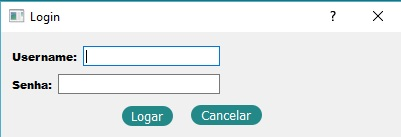

# Almoxarifado-Bajampa
## Programa destinado para organização de almoxarifados em geral.
A aplicação deve permitir que o usuário insira vários Colaboradores de diferentes níveis de acesso, cada nível podendo ir desde apenas visualização dos itens presentes no almoxarifado até a adição de novos itens, remoção de itens ou ate mesmo cadastro de novos colaboradores.

### Instalação

Extrair arquivos, mover pasta **almoxarifado** para a pasta do **QT**, ao executar o programa será criada uma pasta **build** onde devesse colar a pasta **db** presente na pasta **almoxarifado** para a pasta **build/debug**.

**Local da pasta db**

A Figura abaixo mostra a tela inicial da aplicação.

Tela de Login.

