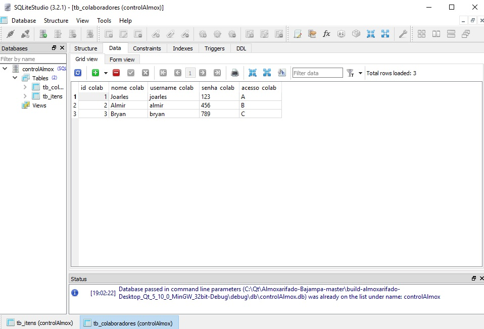
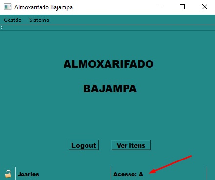
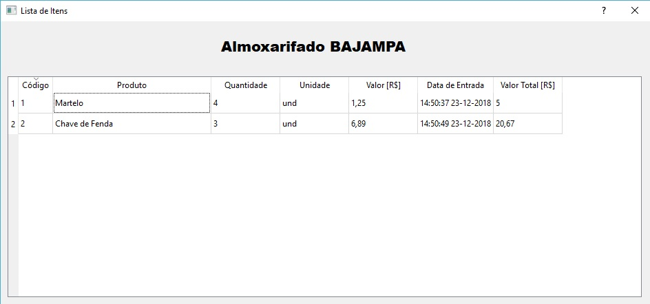
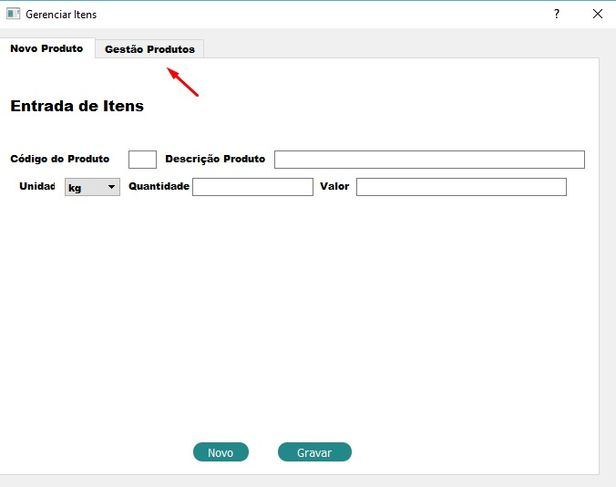
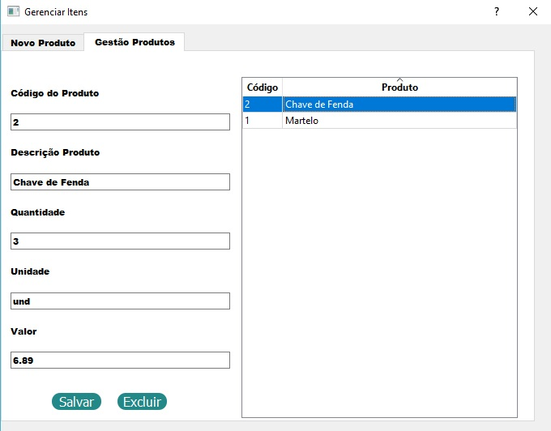
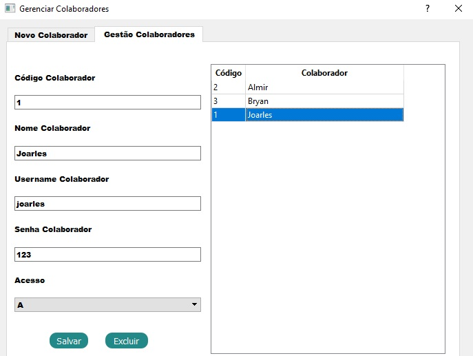

# Almoxarifado-Bajampa
## Programa destinado para organização de almoxarifados em geral.
A aplicação deve permitir que o usuário insira vários Colaboradores de diferentes níveis de acesso, cada nível podendo ir desde apenas visualização dos itens presentes no almoxarifado até a adição de novos itens, remoção de itens ou ate mesmo cadastro de novos colaboradores.

### Instalação

Extrair arquivos, mover pasta **almoxarifado** para a pasta do **QT**, ao executar o programa será criada uma pasta **build** onde devesse colar a pasta **db** presente na pasta **almoxarifado** para a pasta **build/debug**.

**Local da pasta db**

A Figura abaixo mostra a tela inicial da aplicação.

Tela de Login.

### Login por meio do banco de dados SQLite

De forma simbólica foram determinados 3 usuários com níveis de acessos diferentes, tendo o usuário do tipo C o acesso mais restrito podendo apenas visualizar a tabela de itens ja presentes no Almoxarifado, o tipo B pode inserir novos itens, alterar quantidades ou remover itens, e o tipo A tem total liberdade para todas as funções disponiveis no programa, desde as ja citadas ate mesmo o cadastro de novos usuários ou remoção dos mesmos.

**Exemplo Acesso - A**

username - joarles

senha - 123

# Manual do Usuário

Ao logar será informado qual nível de acesso da conta inserida, apartir disso será possível as seguintes opções:

**Nível de Acesso**

Caso o usuário possua nivel de acesso **C**, poderá ir apenas para *Lista de Itens*, onde ver-se todas as informações do item, desde seu nome ate data/hora de entrada, clicando nas abas é possível ordenar os itens!

Caso o usuário possua nivel de acesso **B**, poderá abrir a aba *estoque*, desta forma inserir um novo item ou alterar a sua quantidade na aba *gestão produtos*

**Inserindo novo item**

**Gerenciando Item**

O usuário de acesso **A** além das demais funções liberadas possui também a possibilidade de alterar quaisquer características do item, e adcionar/remover um colaborador, ou alterar o nivel de acesso do colaborador

**Adicionando um novo colaborador**

**Alterando um colaborador existente**

Caso algum usuário sem a permissão para tal função  tente executa-la irá ser exibida uma informação **acesso não permitido**

